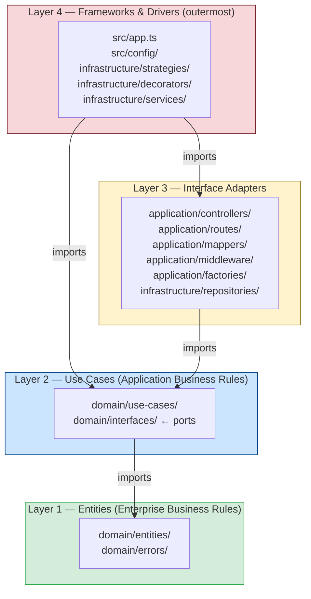

# Architecture — Clean Architecture Layers

Arrow Maze API follows Uncle Bob's **Clean Architecture**. The fundamental rule is the **Dependency Rule**: source code dependencies may only point inward. Nothing in an inner layer knows about an outer layer.

## Layer Diagram

## Layer Responsibilities

### Layer 1 — Entities
Pure TypeScript classes with no external dependencies. Encode enterprise-wide business rules and invariants (e.g., `score ≥ 0`, `difficulty ∈ {easy,medium,hard}`). These change only when fundamental business rules change.

**Folders:** `domain/entities/`, `domain/errors/`

### Layer 2 — Use Cases
Orchestrate the flow of data to and from entities. Each use case (`IUseCase<I,O>`) executes one business operation. Ports (`I*Repository`, `ILeaderboardStrategy`, `ILogger`, etc.) are **interfaces defined here**, making the layer independent of databases and frameworks.

**Folders:** `domain/use-cases/`, `domain/interfaces/`

### Layer 3 — Interface Adapters
Convert data from the format most convenient for use cases into the format most convenient for the external world (HTTP, database). Controllers parse HTTP requests and call use cases; mappers convert domain objects to DTOs; repositories implement the ports using Prisma.

**Folders:** `application/*`, `infrastructure/repositories/`

### Layer 4 — Frameworks & Drivers
The outermost ring. Contains the wiring (`src/app.ts` — Composition Root), framework configuration (`src/config/`), and infrastructure implementations that are not adapters in the strict sense: AOP decorators, leaderboard strategies, and shared services (logger, bcrypt, UUID generator).

**Folders:** `infrastructure/strategies/`, `infrastructure/decorators/`, `infrastructure/services/`, `config/`, `app.ts`

## Dependency Rule in Practice

- A use case (`SyncProgressUseCase`) imports `IProgressRepository` — an interface it owns — never `PostgresProgressRepository`.
- `PostgresProgressRepository` (Layer 3) imports `IProgressRepository` (Layer 2) to implement it.
- `src/app.ts` (Layer 4) knows about both and performs the injection: `new PostgresProgressRepository(prisma)`.
- The domain layer (`domain/`) has zero `import` statements that reference `express`, `prisma`, `bcrypt`, or any other external library.
