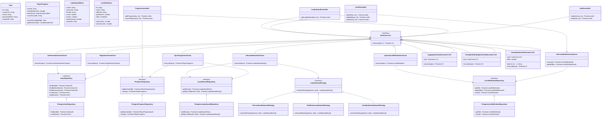

# Class Diagram

Key classes, interfaces and relationships across all four layers.
Arrows: `<|--` implements · `-->` depends on (constructor injection) · `..>` uses

```mermaid
classDiagram

    %% ── Layer 1: Entities ───────────────────────────────────────────────────
    class User {
        +id: string
        +username: string
        +email: string
        +passwordHash: string
        +createdAt: Date
    }

    class PlayerProgress {
        +userId: string
        +completedLevels: string[]
        +bestScores: Map~string,number~
        +currentLevelId: string
        +isLevelCompleted(id) bool
        +getBestScore(id) number|undefined
    }

    class LeaderboardEntry {
        +userId: string
        +username: string
        +levelId: string
        +score: number
        +moves: number
        +timeSeconds: number
        +rankedAt: Date
    }

    class LevelDefinition {
        +id: string
        +name: string
        +difficulty: string
        +parMoves?: number
        +data: LevelData
        +cellCount() number
        +arrowCount() number
    }

    %% ── Layer 2: Ports (interfaces) ─────────────────────────────────────────
    class IUseCase~I,O~ {
        <<interface>>
        +execute(input: I) Promise~O~
    }

    class IUserRepository {
        <<interface>>
        +findById(id) Promise~User|null~
        +findByEmail(email) Promise~User|null~
        +findByUsername(u) Promise~User|null~
        +create(user) Promise~User~
        +update(user) Promise~User~
    }

    class IProgressRepository {
        <<interface>>
        +getByUserId(id) Promise~PlayerProgress|null~
        +save(p) Promise~PlayerProgress~
    }

    class ILeaderboardRepository {
        <<interface>>
        +addEntry(e) Promise~LeaderboardEntry~
        +getByLevel(levelId, limit) Promise~LeaderboardEntry[]~
    }

    class ILevelDefinitionRepository {
        <<interface>>
        +getAll() Promise~LevelDefinition[]~
        +getById(id) Promise~LevelDefinition|null~
        +save(l) Promise~LevelDefinition~
    }

    class ILeaderboardStrategy {
        <<interface>>
        +calculateRanking(entries, limit) LeaderboardEntry[]
    }

    %% ── Layer 2: Use Cases ───────────────────────────────────────────────────
    class RegisterUserUseCase {
        +execute(input) Promise~RegisterUserOutput~
    }
    class AuthenticateUserUseCase {
        +execute(input) Promise~AuthenticateUserOutput~
    }
    class SyncProgressUseCase {
        +execute(input) Promise~PlayerProgress~
    }
    class GetLeaderboardUseCase {
        +execute(input) Promise~LeaderboardEntry[]~
    }
    class GetLevelDefinitionsUseCase {
        +execute() Promise~LevelDefinition[]~
        +getById(id) Promise~LevelDefinition|null~
    }
    class UpsertLevelDefinitionUseCase {
        +execute(input) Promise~LevelDefinition~
    }

    IUseCase <|-- RegisterUserUseCase
    IUseCase <|-- AuthenticateUserUseCase
    IUseCase <|-- SyncProgressUseCase
    IUseCase <|-- GetLeaderboardUseCase
    IUseCase <|-- UpsertLevelDefinitionUseCase

    RegisterUserUseCase --> IUserRepository
    AuthenticateUserUseCase --> IUserRepository
    SyncProgressUseCase --> IProgressRepository
    SyncProgressUseCase --> ILeaderboardRepository
    GetLeaderboardUseCase --> ILeaderboardRepository
    GetLeaderboardUseCase --> ILeaderboardStrategy
    GetLevelDefinitionsUseCase --> ILevelDefinitionRepository
    UpsertLevelDefinitionUseCase --> ILevelDefinitionRepository

    %% ── Layer 3: AOP Decorators (Decorator + DIP pattern) ───────────────────
    class LoggingUseCaseDecorator~I,O~ {
        -inner: IUseCase~I,O~
        +execute(input) Promise~O~
    }
    class ExceptionHandlingUseCaseDecorator~I,O~ {
        -inner: IUseCase~I,O~
        +execute(input) Promise~O~
    }
    class CachingUseCaseDecorator~I,O~ {
        -inner: IUseCase~I,O~
        -ttlMs: number
        -keyFor: (i:I) => string
        +execute(input) Promise~O~
    }

    IUseCase <|-- LoggingUseCaseDecorator
    IUseCase <|-- ExceptionHandlingUseCaseDecorator
    IUseCase <|-- CachingUseCaseDecorator
    LoggingUseCaseDecorator --> IUseCase
    ExceptionHandlingUseCaseDecorator --> IUseCase
    CachingUseCaseDecorator --> IUseCase

    %% ── Layer 3: Leaderboard Strategies ─────────────────────────────────────
    class PerLevelLeaderboardStrategy {
        +calculateRanking(entries, limit) LeaderboardEntry[]
    }
    class TotalScoreLeaderboardStrategy {
        +calculateRanking(entries, limit) LeaderboardEntry[]
    }
    class CombinedLeaderboardStrategy {
        +calculateRanking(entries, limit) LeaderboardEntry[]
    }

    ILeaderboardStrategy <|-- PerLevelLeaderboardStrategy
    ILeaderboardStrategy <|-- TotalScoreLeaderboardStrategy
    ILeaderboardStrategy <|-- CombinedLeaderboardStrategy

    %% ── Layer 3: Repositories (Adapter pattern) ─────────────────────────────
    class PostgresUserRepository {
        +findById(id) Promise~User|null~
        +create(user) Promise~User~
    }
    class PostgresProgressRepository {
        +getByUserId(id) Promise~PlayerProgress|null~
        +save(p) Promise~PlayerProgress~
    }
    class PostgresLeaderboardRepository {
        +addEntry(e) Promise~LeaderboardEntry~
        +getByLevel(levelId, limit) Promise~LeaderboardEntry[]~
    }
    class PostgresLevelDefinitionRepository {
        +getAll() Promise~LevelDefinition[]~
        +save(l) Promise~LevelDefinition~
    }

    IUserRepository <|-- PostgresUserRepository
    IProgressRepository <|-- PostgresProgressRepository
    ILeaderboardRepository <|-- PostgresLeaderboardRepository
    ILevelDefinitionRepository <|-- PostgresLevelDefinitionRepository

    %% ── Layer 3: Controllers ─────────────────────────────────────────────────
    class AuthController {
        +register(req, res) Promise~void~
        +login(req, res) Promise~void~
    }
    class ProgressController {
        +getProgress(req, res) Promise~void~
        +syncProgress(req, res) Promise~void~
    }
    class LeaderboardController {
        +getLeaderboard(req, res) Promise~void~
    }
    class LevelController {
        +getAll(req, res) Promise~void~
        +getById(req, res) Promise~void~
        +upsert(req, res) Promise~void~
    }

    AuthController --> IUseCase
    ProgressController --> IUseCase
    ProgressController --> IProgressRepository
    LeaderboardController --> IUseCase
    LevelController --> GetLevelDefinitionsUseCase
    LevelController --> IUseCase
```
